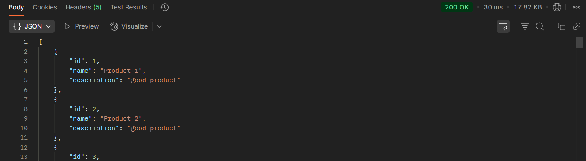

# 🛍️ Product Feed View System

This project aims to evaluate how much **Kafka** combined with **Redis caching** 
can improve the performance of a distributed product feed system, in both response time and scalability.

## 📐 Architecture Overview

The system is composed of two microservices:

- **Service 1 (Product Feed Consumer)**:  
  Exposes one `[GET]` endpoint that returns a product list (similar to a shop feed like Amazon).

- **Service 2 (Product Storage Provider)**:  
  Stores and serves product data.

Communication between services is tested using two approaches:
- **Synchronous REST communication**
- **Asynchronous communication via Kafka**

## ⚙️ Technologies Used

- Java + Spring Boot
- Kafka
- Redis
- Docker

## 🚀 Performance Benchmark

Below are comparisons between different configurations, focusing on response time improvements.

### Scenario 1: 300 Products

#### ❌ REST Communication Only

Best result: **30ms**

#### ✅ Kafka + Redis

**~73% improvement in response time** with Kafka and Redis enabled.
Best result: **8ms**

#### ✅ Kafka + Redis (Returning Raw JSON String)

**~80% improvement** when avoiding payload deserialization (raw `String` returned instead of Java object).
Best result: **6ms**

---

### Scenario 2: 2000 Products

#### ❌ REST Communication Only

Best result: **83ms**

#### ✅ Kafka + Redis

**~80% improvement** with asynchronous communication and caching.
Best result: **16ms**

#### ✅ Kafka + Redis (Returning Raw JSON String)

**~81% improvement**, thanks to reduced processing overhead.
Best result: **15ms**

---

## 📈 Conclusion

This experiment shows that combining Redis with Kafka in a microservices architecture can lead to up 
to **80% faster response times**, especially when avoiding heavy payload transformations.

